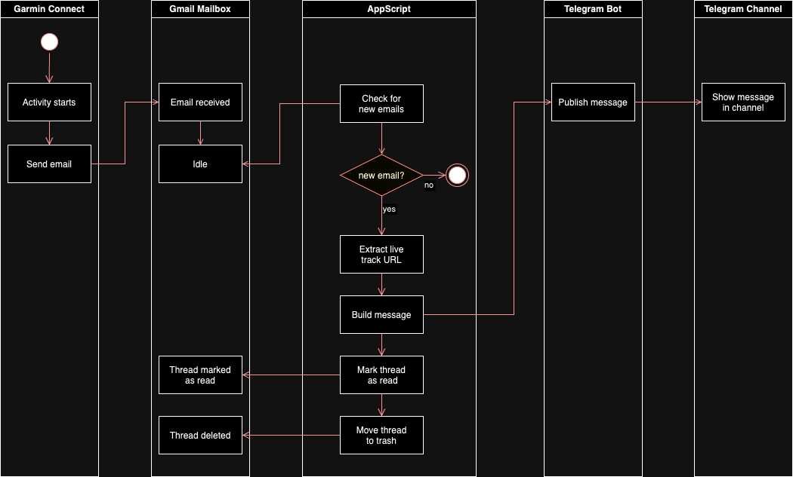
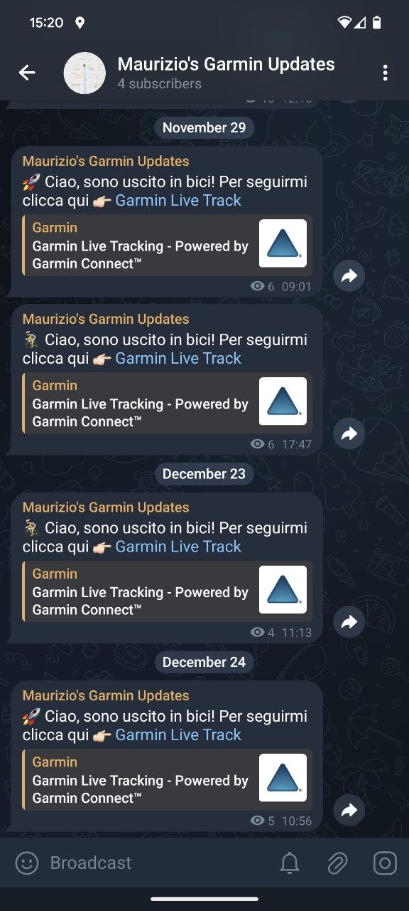
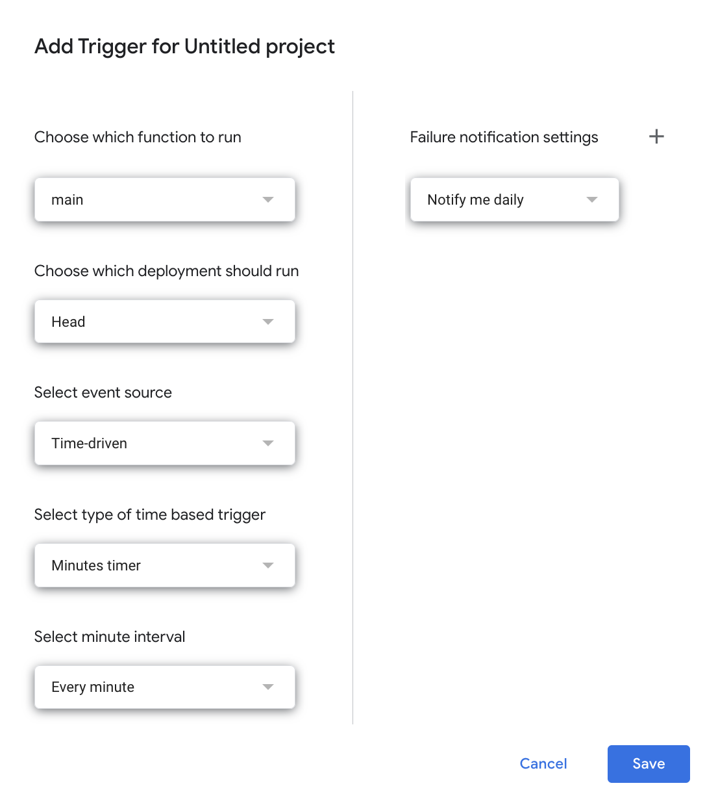

# Garmin LiveTrack to Telegram

## What is this?
[Garmin LiveTrack](https://support.garmin.com/en-US/?faq=oPPijumqU23KHBCZk2wlc9) is a safety feature that lets you share a tracking URL with your contacts so that they can monitor your activity in real time. Unfortunately it only lets you send the URL via email, which is not the most convenient medium for most people.

This repo shows how to forward your LiveTrack URL to a private Telegram channel.

## How it works

The figure below sums up the steps involved:
- we will instruct LiveTrack to send notification emails to a [gmail alias](https://gmail.googleblog.com/2008/03/2-hidden-ways-to-get-more-from-your.html) of your existing account. Assuming your email is `johndoe@gmail.com` we will send notifications to `johndoe+garminlivetrack@gmail.com`. They will reach your mailbox without any further configurations and we will be able to filter them very easily later on
- we will use [Google Apps Script](https://www.google.com/script/start/) to poll your inbox frequently and check for new emails from LiveTrack
- when a new email is found, we will extract the URL, mark the email as read and trash it
- with the previously extracted URL we will build a message and we will ask a Telegram Bot to share it in a Telegram channel. This is a workaround imposed by the fact that Telegram channels APIs are not free, but we can create a bot for free and allow it to publish in our channel.

Down below the final result (my messages are in Italian, but you get the idea)

## Pre-requisites
Before getting started you need:
- a gmail account
- a Telegram account
- a Garmin Connect account (of course!)

If you don't have one already, during the setup we will create:
- a Telegram bot
- a private Telegram channel

## Getting started

### Download the code
Before anything else, save a local copy of two files from this repo:
- `Code.gs`
- `Secrets.gs`

We will edit them shortly.

### Create a Telegram Bot
To create a new bot, contact [@BotFather](https://telegram.me/BotFather) on Telegram and issue the `/newbot` command. Follow the instructions, at the end take note of the authorization token and replace it to the placeholder string in the `Secrets.gs` file.

You can find more extensive instructions on how to create a bot in [this](https://core.telegram.org/bots/features#creating-a-new-bot) page.

### Create a Telegram Channel
To create a new channel, follow the [official instructions](https://telegram.org/faq_channels#q-what-39s-a-channel) for your mobile app, with a few key points:
- make the channel private, you will manually add users when you are ready
- add your newly created bot to the channel. As of today you can only add bots as Admins, and that's exactly what we want. I suggest you restrict admin rights to "Post Messages" only.
- open telegram from your web browser (web.telegram.org), open the channel and take note of the URL. It should be something like `https://web.telegram.org/a/#-1001927033308`, the last portion (e.g. `-1001927033308`)  is the Channel ID. Go to the `Code.gs` file and set it as the value for the `TELEGRAM_CHAT_ID` constant.

### Configure Garmin LiveTrack
To setup LiveTrack follow the [official instructions](https://support.garmin.com/en-US/?faq=HbqxxbiBGA3mDhlLX4GUw8) and don't forget to add your email alias a recipient (e.g. `johndoe+garminlivetrack@gmail.com`).

### Configure Apps Script

To create a new Apps Script project:
1. go to the [Google Apps Script](https://script.google.com/home) home page and click `New Project`
2. replace contents of the default `Code.gs` file with your own local copy
3. create a new file, name it `Secrets.gs` and replace its contents with those from your local copy of the same file
4. Click on the plus sign next to the `Services` menu item, search for  `Gmail API` and then add it.

#### Run a test

Before scheduling the script, let's test it:
1. from your Garmin device start a new activity
2. open your gmail inbox and verify that the LiveTrack email has been received. Subject should be "You are invited to watch a live activity". 
    - Do not open it and do not mark it as read!
3. from Apps Script select the `main` function from the dropdown menu next to the `Debug` button in the toolbar and then click `Run`. 
   - The first time you run the script you will be asked to "Review Permissions". Do so and when you get to the `Google hasn’t verified this app` warning click `Advanced` and then `Go to <name of your project here> (unsafe)` (it's perfectly safe in this contest). Finally click `Allow`.
4. check your Telegram channel to verify that the message has been published
5. check your mailbox to verify that the email has been marked as read and moved to the trash 

If at any step you get the wrong results, check the logs in Apps Script.

#### Schedule the script
In Apps Script go to the `Triggers` section from the left menu, click `Add Trigger` (bottom right corner) and configure as shown in the screenshot below. 

Key points are:
- Function to run: `main`
- Schedule type: time-based, to be run every minute
- Get daily or weekly failure notifications to monitor runs

Last but not least, don't forget to add your beloved ones to the Telegram channel!

### Known limitations
Occasionally the script might fail and you will get an email from Apps Script with the subject stating "Summary of Failures". 
So far, these are the errors I have received:
- `We're sorry, a server error occurred. Please wait a bit and try again.`
- `We're sorry, a server error occurred while reading from storage. Error code FAILED_PRECONDITION`.
- `Exception: API call to gmail.users.getProfile failed with error: Empty response`

While I don't fully understand what caused them, they were all temporary and didn't impact next runs of the script.